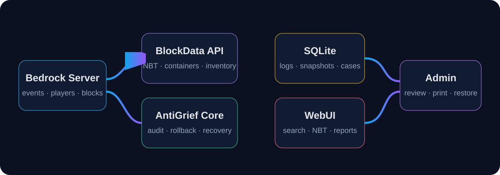

<p align="center">
  <a href="https://github.com/TheNINJALLO/endstone-antigrief/releases/tag/v1.5.13">
    
  </a>
</p>

<p align="center">
  <a href="https://github.com/TheNINJALLO/endstone-antigrief/releases/tag/v1.5.13"></a>
  <a href="https://github.com/TheNINJALLO/endstone-antigrief/actions/workflows/ci.yml"></a>
  
  
  <a href="LICENSE"></a>
</p>

**AntiGrief** is an Endstone moderation and recovery plugin for Minecraft Bedrock Dedicated Server. It records player activity, captures exact container and inventory NBT through the BlockData API, restores damaged areas, returns confirmed stolen items, and produces printable evidence reports through a secured WebUI.

> Current release: **v1.5.13** · Required dependency: **BlockData API v0.4.8 or newer**

## Highlights

- Exact block, container, and inventory snapshots with canonical NBT
- Coordinated rollback for placed, broken, exploded, and looted targets
- Confirmed item recovery that only runs after an operator executes `/agback`
- Chest, barrel, hopper, bundle, backpack, player inventory, armor, offhand, and Ender Chest inspection
- Recursive bundle and `minecraft:storage_item` rendering without empty-slot noise
- Printable grief-case reports with timelines, affected bounds, recovery results, and SHA-256 evidence hashes
- FastAPI WebUI with secret-key authentication and SQLite-backed history
- UTF-8-safe player inventory fallback for malformed legacy item metadata
- Automatic database migrations and backward-compatible upgrades

<p align="center"></p>

## Compatibility

| Component | Supported version |
|---|---|
| Minecraft Bedrock Dedicated Server | `1.26.33.1` |
| Endstone | `0.11.6` |
| Python | `3.14` |
| BlockData API | `0.4.8+`, exact platform package |
| Operating systems | Linux x64 and Windows x64 |

AntiGrief depends on the native plugin named `blockdata_api`. Install both the BlockData native library and its matching Python inspector wheel before installing AntiGrief.

## Quick installation

1. Stop the server.
2. Download the complete BlockData package matching the server platform and copy both BlockData plugin files into `plugins/`.
3. Copy `endstone_antigrief-1.5.13-py3-none-any.whl` into `plugins/`.
4. Remove older AntiGrief wheels so Endstone cannot load two versions.
5. Start the server and confirm the console reports both `BlockData API connected` and `Player Inventory API connected`.
6. Open `plugins/antigrief_data/config.json`, replace the default WebUI secret, and restart once more.
7. Browse to `http://SERVER_ADDRESS:8098` and sign in with the configured secret.

See the [full installation guide](docs/installation.md) for Linux, Windows, Pterodactyl, firewall, upgrade, and verification steps.

## Essential commands

| Command | Permission | Purpose |
|---|---|---|
| `/ag [x y z] [hours] [radius]` | Member | Query nearby activity or open the log form |
| `/ags [type] [keyword] [hours]` | Operator | Search logs by action and keyword |
| `/agcontainer [player] [hours] [radius]` | Operator | Review container access and item deltas |
| `/ago [player]` | Operator | Show a live inventory summary |
| `/agback <hours> <x y z> <radius> [player]` | Operator | Confirm an incident, roll it back, recover items, and create a report |
| `/agconfiscate <player>` | Operator | Retry recovery rows already created by `/agback` |
| `/agclean <hours>` | Operator | Remove old ordinary records while preserving case reports |
| `/aghelp` | Member | Show command help |

Ban, device-ban, density, and ownership-inspection commands are documented in the [complete command reference](docs/commands.md).

## WebUI navigation

The dashboard opens with four working areas:

- **Event Log:** filters by time, player, action, location, and keyword. Container records expose canonical NBT and readable item lists.
- **Player Inventories & Ender Chests:** shows live or cached snapshots with Main, Armor, Offhand, Ender Chest, and Full Snapshot tabs.
- **Grief Proof Reports:** lists cases generated by `/agback`; each can be opened, printed, or saved as PDF.
- **Bans and Statistics:** displays active moderation records and activity totals.

Every readable item card includes count, custom name, lore, enchantments, damage, nested bundles, nested backpacks, and expandable raw NBT.

## Documentation

- [Installation](docs/installation.md)
- [Configuration](docs/configuration.md)
- [Commands](docs/commands.md)
- [WebUI guide](docs/webui.md)
- [Rollback and item recovery](docs/rollback-and-recovery.md)
- [Containers, inventories, and bundles](docs/inventories-and-bundles.md)
- [Grief reports](docs/grief-reports.md)
- [Database and retention](docs/database.md)
- [Troubleshooting](docs/troubleshooting.md)
- [Pterodactyl deployment](docs/pterodactyl.md)
- [Release process](docs/release-process.md)
- [Security](SECURITY.md)
- [Contributing](CONTRIBUTING.md)

A GitHub Wiki source tree is included in [`wiki/`](wiki/). The Pages documentation and Wiki synchronization workflows are included under `.github/workflows/`.

## Building from source

```bash
python -m pip install --upgrade pip
python -m pip install -e ".[dev]"
python -m pytest
python -m build
```

The wheel is created in `dist/`. Release tags matching `v*` run the same tests, build the wheel and source archive, verify the package version, and attach both files to a GitHub Release.

## Data safety

AntiGrief does not automatically punish players for opening a friend’s container. Container access remains evidence until an operator confirms an incident with `/agback`. Item removal occurs only after the destination container has been restored and verified.

Before production use, back up the world and `plugins/antigrief_data/agdata.db`. Rollbacks alter live world data and should be tested on a staging copy after Minecraft, Endstone, or BlockData upgrades.

## License

Released under the [MIT License](LICENSE).
